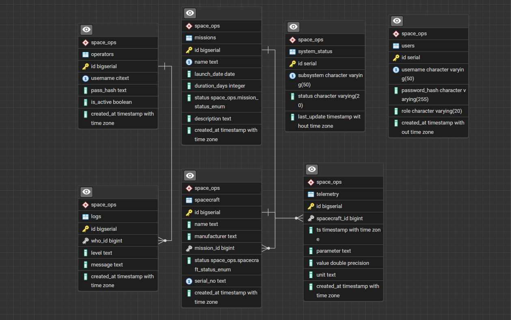

# Проєкт бази даних космічних місій

## Опис
Реляційна база даних для зберігання інформації про космічні місії, космічні апарати, екіпаж, наземні станції, телеметрію та аномалії.  
Проєкт створено в рамках курсової роботи з дисципліни **"Бази даних"**.

---

## Технології
- MySQL  
- SQL Workbench / phpMyAdmin  
- XAMPP (опціонально)  
- Docker (опціонально)  

---

## Функціональний опис
- Управління місіями  
- Облік космічних апаратів  
- Облік екіпажу та участі в місіях  
- Збереження телеметричних даних  
- Фіксація аномалій  
- Управління наземними станціями  
- Корисний вантаж (опціонально)

---

## Структура БД
- missions  
- spacecraft  
- mission_spacecraft  
- crew_members  
- mission_crew  
- ground_stations  
- telemetry  
- anomalies  
- cargo  

---

## Запуск
1. Запустити MySQL або XAMPP  
2. Імпортувати файл **schema.sql** у MySQL  
3. (Опціонально) Імпортувати **seed_data.sql**  

База готова до використання

ER-діаграма
 

альтернативний текст

Автор

Гупалюк Роман
ІПЗ-3/2